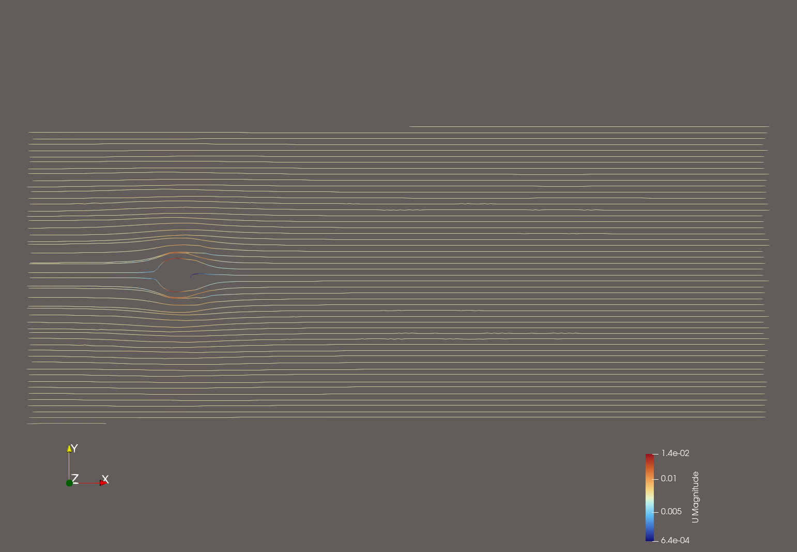

# OpenFOAM Learning Project

Welcome to my workspace dedicated to **Computational Fluid Dynamics (CFD)** with OpenFOAM. This repository documents my progress in fundamentals for aeronautical engineering.

## Objective
The goal of this project is to master the complete CFD pipeline:

- **Pre-processing**: Mesh generation (essentially blockMesh & snappyHexMesh).

- **Solving**: Simulation using OpenFOAM solvers (icoFOAM, simpleFOAM).

- **Post-processing**: Analysis and visualization using ParaView.

## Roadmap of Small Studies 
Here are the studies I'm conducting to validate my skills:

1. **Lid-Driven Cavity**: Validation of the OpenFOAM folder structure and understanding the vortex center with a typical case.

2. **Canal Obstacle**: Importing obstacles (such as cylinder for the Von Karman Vortex case) via STL and using `snappyHexMesh` to observe their influence on simple streams (first 2.5D then 3D).

3. **Airfoil Analysis**: Studying the behavior of a 3D airfoil.

## Tech Stack
- **OS**: macOS M1 (Workstation)
- **Container**: Docker (OpenFOAM-v2512)
- **Post-processing**: ParaView
- **Versioning**: Git / GitHub

## Visualization

---
*Project completed as part of my independent CFD learning.*
