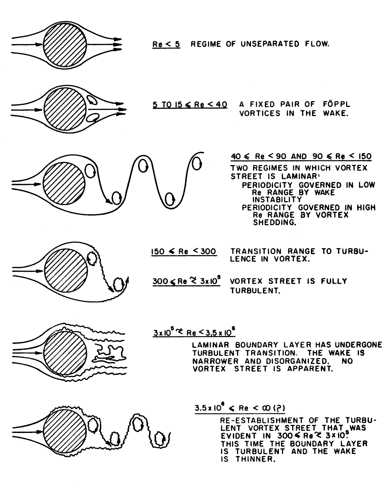

# Case 2: Von Karman Vortex Street Simulation (Unsteady Laminar Flow)

## Overview
This case focuses on the simulation of an unsteady flow behind a circular cylinder, a classic CFD benchmark. The objective was to capture the **Von Karman Vortex Street** using OpenFOAM (and compare the results with theory).

## Geometry & Pre-processing
Initially, I faced challenges with the STL scale and domain boundaries.
*   **Rescaling:** Used `surfaceCheck` and `surfaceTransformPoints` to ensure the cylinder diameter was $D = 0.2\text{m}$ (rescaled from mm to meters).
*   **Domain Sizing:** To avoid edge effects, I designed the fluid domain following standard aerospace guidelines: $5D$ upstream/sides and $15D$ downstream.
*   **2.5D Constraints:** For a 2D simulation in OpenFOAM, the domain thickness (Z-axis) was set to one cell layer ($0.05\text{m}$), matching the cylinder height.

## Meshing Challenges & Logic
The meshing process was a major learning curve, especially regarding **SnappyHexMesh** on a single-cell layer (2.5D).
*   **Aspect Ratio Control:** I focused on keeping the background grid (`blockMesh`) cubic ($50\text{mm}$ sides). This minimized the aspect ratio ($1.22$), providing a stable foundation for the snapping process.
*   **Solving the "10-point cell" error:** I encountered crashes when forcing refinement levels to stay 2D. I resolved this by carefully balancing refinement levels and ensuring the snapping didn't collapse cells on the Z-front/back planes.

### Mesh Quality Validation (`checkMesh`)
To ensure high-fidelity results, the mesh was validated against industry standards:
*   **Max Non-Orthogonality:** $25.2^\circ$ (Well below the $65^\circ$ critical threshold), ensuring high numerical stability.
*   **Max Aspect Ratio:** $1.22$ (Optimal for resolving sharp gradients in the wake).
*   **Skewness:** Maintained within safe bounds for the PIMPLE algorithm.

## Solver Evolution Troubleshooting
One of the key technical takeaways was the transition from `icoFoam` to `pimpleFoam`.
*   **From Fixed to Adaptive $\Delta t$:** I realized `icoFoam` ignored `adjustTimeStep`, leading to sub-optimal computation times on my Mac M1. Migrating to `pimpleFoam` allowed for an adaptive time-step based on a target Maximum Courant Number ($Co_{max} = 0.8$).
*   **The Metastability Challenge:** Early simulations at $Re=150$ remained stubbornly symmetric. I learned that:
    1. Numerical noise isn't always enough to break symmetry; a small "kick" (perturbation in $U_y$) was added to the inlet to trigger the instability.
    2. **Advection Time:** At low velocities, the flow requires several hundred seconds of physical time to clear the initial stationary field and fully develop the vortex street.

## Result Interpretation & Validation
I compared the results with **Lienhard (1966)**'s classification of vortex regimes :



# Reynolds 150
At $Re \approx 150$, the simulation correctly predicts a stable, laminar vortex street :


# Reynolds 600
We espect the vortices structure to become turbulent at this Reynolds.


### Ongoing & Future Work
- [x] **Laminar Validation:** Match Strouhal Number ($St \approx 0.18$) with theory.
- [ ] **Mesh Independence Study:** Comparing drag/lift coefficients across three refinement levels.
- [ ] **Turbulence Transition:** Scaling up to $Re > 4,000$ using the $k-\omega$ SST model and implementing boundary layer inflation (snappyHexMesh layers).

---

## How to Launch
Run this sequence in your OpenFOAM terminal:

```bash
# Mesh generation
blockMesh
surfaceFeatureExtract
snappyHexMesh -overwrite
checkMesh

# Execution
pimpleFoam

# Clean-up to reload (Utility script)
./CleanMesh
