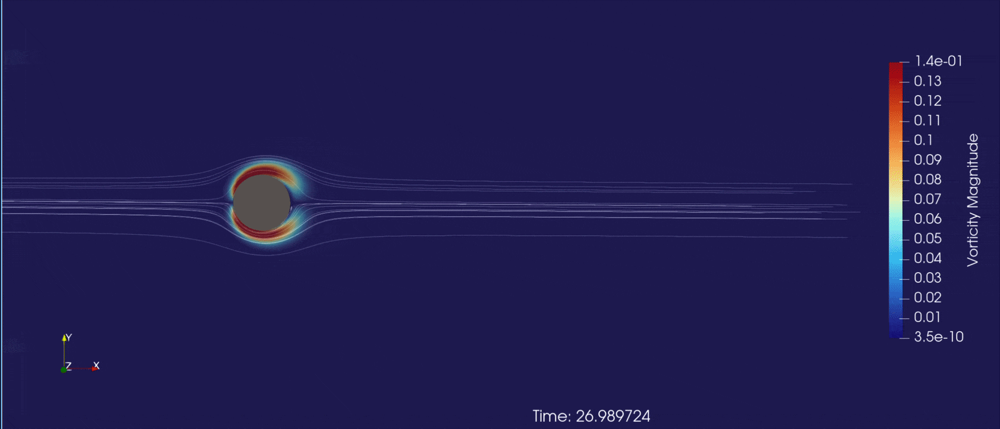
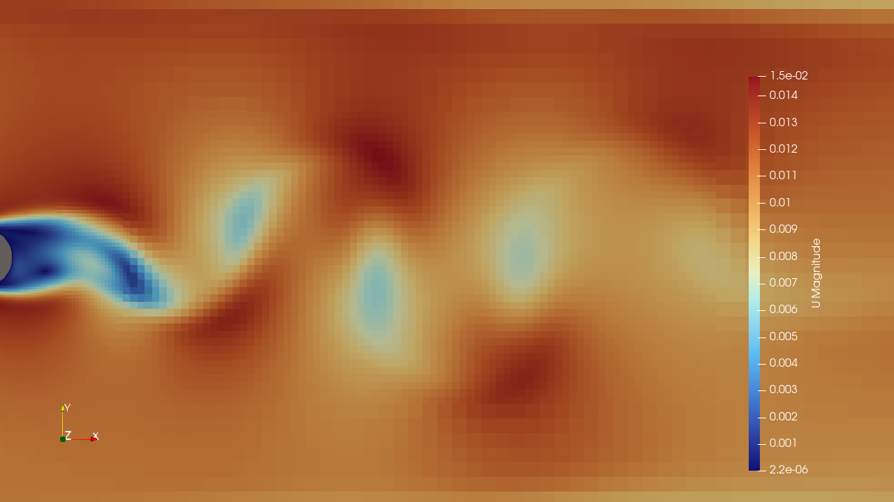
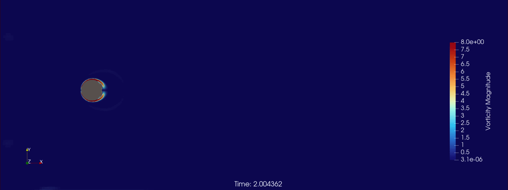
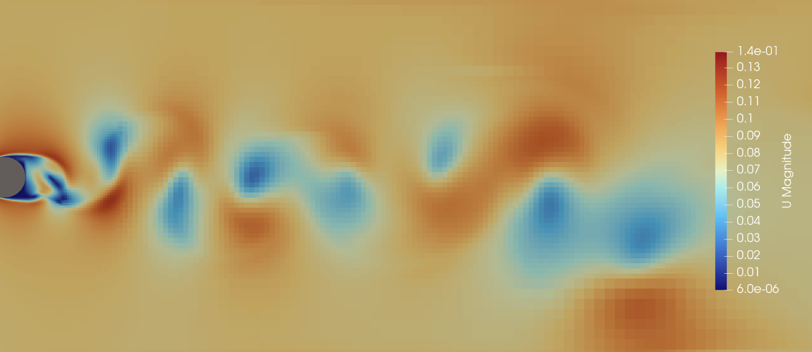
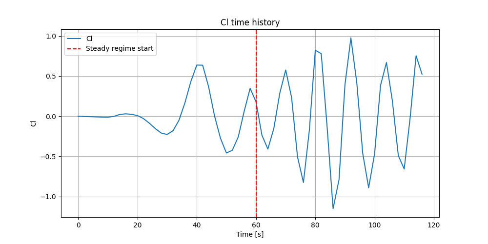
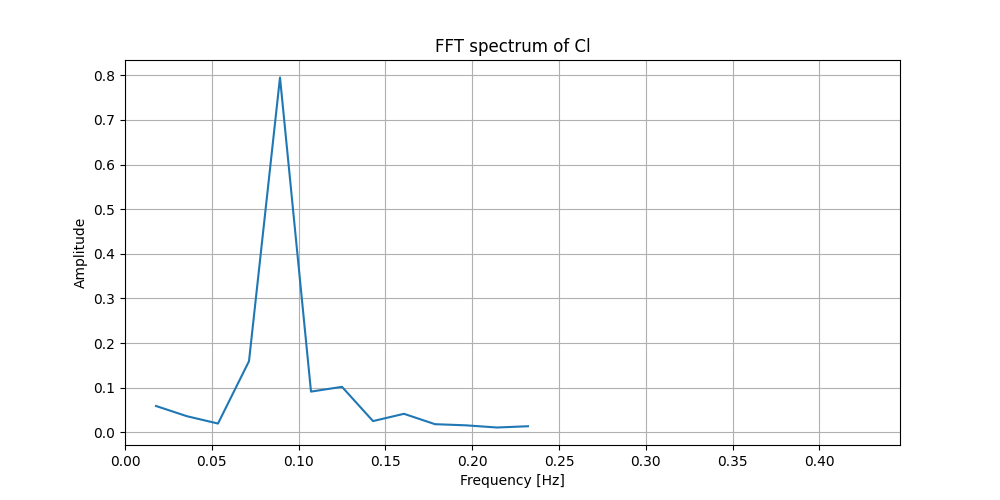

# Case 2: Von Karman Vortex Street Simulation (Unsteady Laminar Flow)

## Overview
This case focuses on the simulation of an unsteady flow behind a circular cylinder, a classic CFD benchmark. The objective was to capture the **Von Karman Vortex Street** using OpenFOAM (and compare the results with theory).

## Geometry & Pre-processing
Initially, I faced challenges with the STL scale and domain boundaries.
*   **Rescaling:** Used `surfaceCheck` and `surfaceTransformPoints` to ensure the cylinder diameter was $D = 0.2\text{m}$ (rescaled from mm to meters).
*   **Domain Sizing:** To avoid edge effects, I designed the fluid domain following standard aerospace guidelines: $5D$ upstream/sides and $15D$ downstream.
*   **2.5D Constraints:** For a 2D simulation in OpenFOAM, the domain thickness (Z-axis) was set to one cell layer ($0.05\text{m}$), matching the cylinder height.

## Meshing Challenges & Logic
The meshing process was a major learning curve, especially regarding **SnappyHexMesh** on a single-cell layer (2.5D).
*   **Aspect Ratio Control:** I focused on keeping the background grid (`blockMesh`) cubic ($50\text{mm}$ sides). This minimized the aspect ratio ($1.22$), providing a stable foundation for the snapping process.
*   **Solving the "10-point cell" error:** I encountered crashes when forcing refinement levels to stay 2D. I resolved this by carefully balancing refinement levels and ensuring the snapping didn't collapse cells on the Z-front/back planes.

### Mesh Quality Validation (`checkMesh`)
To ensure high-fidelity results, the mesh was validated against industry standards:
*   **Max Non-Orthogonality:** $25.2^\circ$ (Well below the $65^\circ$ critical threshold), ensuring high numerical stability.
*   **Max Aspect Ratio:** $1.22$ (Optimal for resolving sharp gradients in the wake).
*   **Skewness:** Maintained within safe bounds for the PIMPLE algorithm.

## Solver Evolution Troubleshooting
One of the key technical takeaways was the transition from `icoFoam` to `pimpleFoam`.
*   **From Fixed to Adaptive $\Delta t$:** I realized `icoFoam` ignored `adjustTimeStep`, leading to sub-optimal computation times on my Mac M1. Migrating to `pimpleFoam` allowed for an adaptive time-step based on a target Maximum Courant Number ($Co_{max} = 0.8$).
*   **The Metastability Challenge:** Early simulations at $Re=150$ remained stubbornly symmetric. I learned that:
    1. Numerical noise isn't always enough to break symmetry; a small "kick" (perturbation in $U_y$) was added to the inlet to trigger the instability.
    2. **Advection Time:** At low velocities, the flow requires several hundred seconds of physical time to clear the initial stationary field and fully develop the vortex street.

## Result Interpretation & Validation
I compared the results with **Lienhard (1966)**'s classification of vortex regimes :

<p align="center">
  <b>Fig. 0: Regime of fluid flow across cylinders</b>
</p>
<table align="center">
  <tr>
    <td align="center">
      <br/>
    </td>
  </tr>
</table>


# Reynolds 40
At this Reynolds number, the flow is steady. The adverse pressure gradient behind the cylinder causes the boundary layer to detach, forming two symmetric recirculation bubbles, called Föppl vortices.

<p align="center">
  <b>Fig. 1: Föppl vortices at Re=40</b>
</p>
<table align="center">
  <tr>
    <td align="center">
      <br/>
        <sub>Vorticity and Stream Lines for vortex visualisation (15 advective times)</sub>
    </td>
  </tr>
</table>

**Key Observations:**
* Unlike the following case, the wake here is perfectly symmetric and stable. The Lift Coefficient ($C_l$) remains strictly at $0$ (calculated mean of $0.00004$).
* The added streamlines clearly show the fluid particles being trapped in two counter-rotating vortices.
* Interestingly, the Vorticity Magnitude is not concentrated on the vortices themselves but along the shear layers,because it captures mainly the sheer magnitude and velocity gradients (which are very low in the bubbles).

**Numerical Validation**:
* The measured $C_d$ is constant (no oscillations), with mean = 2.016069 and STD=0.005, is slightly higher than the expected theoretical values for this regime ($\approx 1.5 - 1.6$), that is likely due to the blockage effect of the domain boundaries and localized mesh sensitivity. A domain independence test (widening the boundaries) would be the next step to reach a convergence.
* The longitudinal extent of the bubbles was measured at approximately $2.2 \times D$, which is in agreement with the classic literature for $Re=40$.

# Reynolds 130
At $Re \approx 130$, the simulation correctly predicts a stable, laminar vortex street :

<p align="center">
  <b>Fig. 2: Karman Vortex Street at Re =130</b>
</p>
<table align="center">
  <tr>
    <td align="center">
      <br/>
        <sub>(a) Vorticity Flow</sub>
    </td>
    <td align="center">
      <br/>
        <sub>(b) Velocity distribution after 20 advective times</sub>
    </td>
  </tr>
</table>

**Key Observations:**
* The flow separation point is located around the back of the cylinder, typical for low Reynolds regimes.
* The vortices appear smooth and have a circular shape compatible with laminar flow.
* The vortices lose consistence after 4 iteration (approximately 15 advection distances).

# Reynolds 1000

At $Re = 1000$, we observe the transition towards a more chaotic wake. While the periodic shedding remains, the flow exhibits clear signs of increased instability compared to the $Re = 150$ case.

<p align="center">
  <b>Fig. 3: Karman Vortex Street at Re =1000</b>
</p>
<table align="center">
  <tr>
    <td align="center">
      <br/>
        <sub>(a) Vorticity Flow</sub>
    </td>
    <td align="center">
      <br/>
        <sub>(b) Velocity distribution after 30 advective times</sub>
    </td>
  </tr>
</table>

**Key Observations:**
* The shear structures are significantly elongated behind the cylinder.
* The flow separation point has migrated upstream along the cylinder’s shoulders, typical of higher Reynolds regimes.
* The vortices appear more "agitated" and lose their perfectly circular laminar shape shortly after shedding.
* The vortices lose consistence far later than in the previous case.

**Numerical validation**
To get a macroscopic check of this case, we can monitor the Strouhal Number ($St$), which characterizes the vortex shedding frequency:
The simulation at $Re=1000$ was validated both qualitatively and quantitatively with the postProcess python program. After correcting the reference parameters ($A_{ref}$ and $U_{inf}$), the mean drag coefficient stabilized at $C_d \approx 1.35$. Frequency analysis of the lift coefficient yielded a Strouhal number of $St \approx 0.237$, showing a strong agreement with the theoretical value of $0.21$. 

<p align="center">
  <b>Fig. 3: Frequency Analysis of the Re=1000 vortex shedding</b>
</p>
<table align="center">
  <tr>
    <td align="center">
      <br/>
        <sub>(a) Cl Oscillation</sub>
    </td>
    <td align="center">
      <br/>
        <sub>(b) Fast Fourier Transform of Cl</sub>
    </td>
  </tr>
</table>

**Limitations**
The laminar-biased solver combined with the current mesh density acts as a numerical filter. This leads to a "numerical diffusion" that likely dissipates the finer turbulent scales, and overestimates slightly the $St$. In a 2.5D simulation, the solver effectively "swallows" some of the 3D instabilities that would naturally occur at this Reynolds number. 

### Following
The cases with higher Reynolds number (often >2000) must be considered with an entire new solver which will fully capture the flow's non negligeable turbulent aspects. See the `KarmanVortexStreetTurbulent` directory.

---

## How to Launch
Run this sequence in your OpenFOAM terminal:

```bash
# Mesh generation
blockMesh
surfaceFeatureExtract
snappyHexMesh -overwrite
checkMesh

# Execution
foamListTimes -rm && rm -rf postProcessing # To remove previous runs
pimpleFoam

# Clean-up to reload (Utility script)
./CleanMesh
