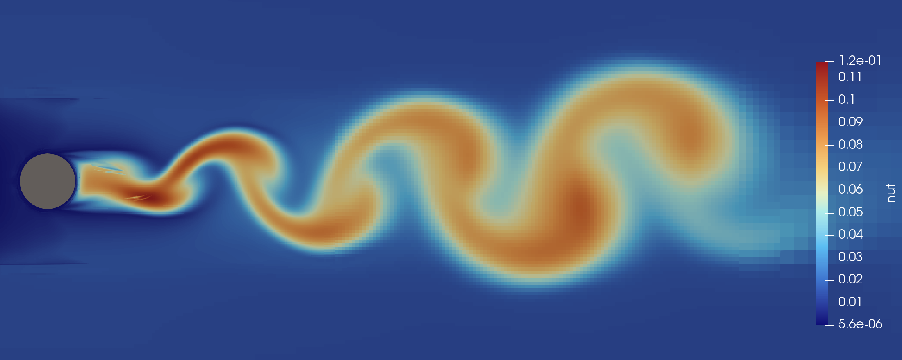
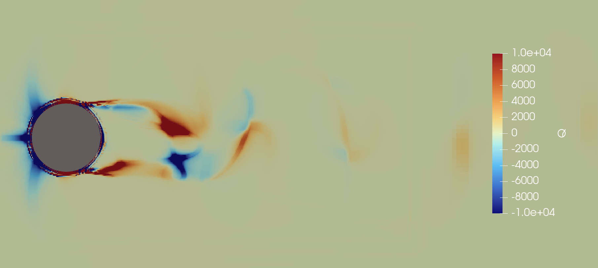
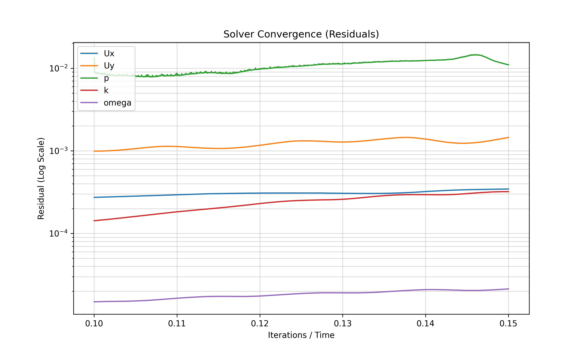
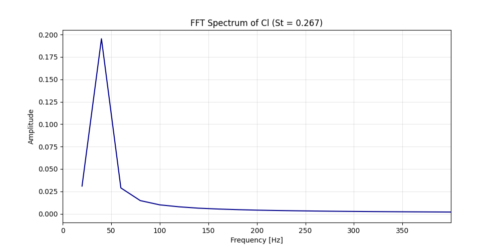

# Case 2b: Von Karman Turbulent Vortex Street Simulation 

## Mesh Quality & Validation
To capture the turbulent boundary layer and the complex wake dynamics, the mesh density was quadrupled compared to the laminar case, focusing specifically on the **near-wake region**.

**Key `checkMesh` Statistics:**
* **Cell Count:** ~1.2 million cells
* **Boundary Layers:** 6+ layers with high-resolution near-wall refinement.
* **Max Aspect Ratio:** 4.98 (Well within stability limits).
* **Max Skewness:** 0.38 (Excellent cell orthogonality).
* **Non-Orthogonality:** Max 38.06° / Average 4.41° (Highly stable for PIMPLE/PISO solvers).

> **Verification:** 
 Post-run $y^+$ analysis : $y^+$ : min = 0.505498, max = 25.2723, average = 12.0944 across the cylinder surface.
 This indicates that the first cell height is located in the buffer layer. While the $k-\omega$ SST model handles this via automatic wall functions, a further refinement (dividing the first cell height, or adding boundary layers) would be required to fully resolve the viscous sublayer ($y^+ < 1$). This highlights the computational cost vs. accuracy trade-off in high Reynolds simulations.

## High-Performance Computing 
The simulation was optimized for the **Apple Silicon M1 SoC** using parallel processing:
* **Domain Decomposition:** 4 sub-domains (approx. 300k cells per core).
* **Speed-up:** Achieved a $2.5\times$ to $3\times$ reduction in wall-clock time compared to serial execution.
* **Method:** Simple geometric decomposition for balanced CPU load.

## Turbulence Modeling
I implemented the **$k-\omega$ SST (Shear Stress Transport)** model, chosen for its superior performance in predicting flow separation under adverse pressure gradients.

* **Field Initialization:** Configured `k`, `omega`, and `nut` in the `0/` directory.
* **Numerical Schemes:** Used second-order schemes for divergence and gradients to balance stability and accuracy.
* **Philosophy:** While the simulation is 2D, the SST model provides a Reynolds-Averaged (RANS) approximation of the 3D energy cascade through the turbulent viscosity ($\nu_t$).

## Results & Physical Analysis
At $Re = 4 \cdot 10^5$, the flow is in the **high-Reynolds regime**. 

**Observations:** 
* The 2D constraint preserves a coherent vortex street structure. While 3D instabilities (vortex stretching) are not explicitly resolved, the turbulent Viscosity ($\nu_t$) field clearly shows massive production in the wake, accounting for the energy dissipation of the chaotic flow.
* The positive values (red) of the Q-criterion highlight areas where rotation dominates over strain. The dissipation of these structures as they move downstream is a direct result of the $k-\omega$ SST turbulence modeling.

<p align="center">
  <b>Turbulent flow across cylinder at Re 4e5</b>
</p>
<table align="center">
  <tr>
    <td align="center">
      <br/>
      <sub>(a) Turbulent Viscosity ($\nu_t$) Distribution (22 advective times)</sub>
    </td>
    <td align="center">
      <br/>
      <sub>(b) Q-criterion distribution (22 advective times)</sub>
    </td>
  </tr>
</table>

**Quantification:** 
* The performance analysis revealed a merely constant $C_d=1.2759$ and $C_d=0.011$ still in a bit in transition ($STD=0.14$). 
* The absence of the 'drag crisis' ($C_d$ drop around 3e+5 Reynolds) is explained by the 2D nature of the simulation, which over-predicts vortex coherence by preventing 3D turbulent dissipation (vortex stretching). However, the periodic stability of the residuals and the $Cl$ signal validates the numerical consistency of the solver.
* The Stouhal number was $S_t \approx 0.266$, which is slightly higher than the classical $0.20$ value, for the same reasons as for the $Re=1000$ case, and also because the steady state was not perfectly 

<p align="center">
  <b>Simulation Numerical validation</b>
</p>
<table align="center">
  <tr>
    <td align="center">
      <br/>
    </td>
    <td align="center">
      <br/>
    </td>
  </tr>
</table>

## How to Launch


```bash
# Pre-processing (Mesh)
blockMesh
surfaceFeatureExtract
snappyHexMesh -overwrite
checkMesh

# Execution (parallel)
# Clean previous results & decompose
foamListTimes -rm && rm -rf postProcessing
decomposePar 
# Run the solver (Optimized for Docker/M1)
mpirun --allow-run-as-root -np 4 pimpleFoam -parallel > log.pimpleFoam &
# Live-track convergence
tail -f log.pimpleFoam

# Post-Processing
# Reconstruct sub-domains for ParaView
reconstructPar 
# Optional: Clean up to save disk space (Mac SSD safety)
mv log.pimpleFoam final_calculation.log
rm -rf processor*
